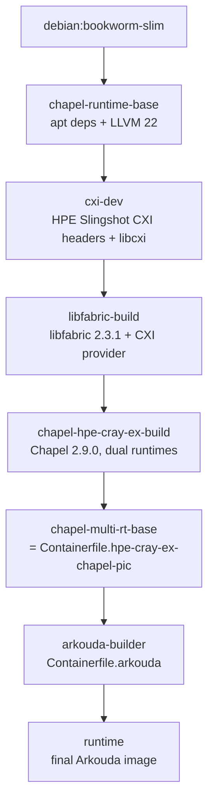

# Build & Usage Guide: Chapel + Arkouda Containers

This guide covers the two supported container images and the scripts that
build, run, and package them.

## Table of contents

- [Architecture](#architecture)
- [Prerequisites](#prerequisites)
- [Quick start](#quick-start)
- [1. Building the Chapel base image](#1-building-the-chapel-base-image)
- [2. Building Arkouda](#2-building-arkouda)
- [3. Running the Arkouda container](#3-running-the-arkouda-container)
- [Converting to an Apptainer/Singularity SIF](#converting-to-an-apptainersingularity-sif)
- [Corporate CA / TLS-inspecting proxy support](#corporate-ca--tls-inspecting-proxy-support)
- [HPC library forwarding with e4s-cl](#hpc-library-forwarding-with-e4s-cl)
- [Chapel runtime environment reference](#chapel-runtime-environment-reference)
- [Troubleshooting](#troubleshooting)
- [Legacy / reference material](#legacy--reference-material)

## Architecture



- **`Containerfile.hpe-cray-ex-chapel-pic`** produces a Chapel image with
  *both* the `hpe-cray-ex` platform (OFI comm layer over libfabric, with the
  CXI provider for HPE Slingshot) and the `linux64` platform
  (`CHPL_COMM=none`) built and available under `$CHPL_HOME`, selectable via
  the `chapel-start` wrapper. The `linux64` build step also runs
  `make chapel-py-venv` and `make mason`, so the image ships the Chapel
  Python bindings (importable via `python3 -c "import chapel"`, on
  `$PYTHONPATH`) and the `mason` package manager on `$PATH`.
- **`Containerfile.arkouda`** takes that image as its
  `CHAPEL_BASE_IMAGE` build argument and builds Arkouda against whichever
  runtime is active in the base image's environment (`hpe-cray-ex`/OFI by
  default), producing a single `arkouda_server` binary. The Arkouda Python
  client package is installed editable (`pip install -e .[dev]`) into the
  same `/opt/arkouda-venv` virtual environment that's copied into the final
  runtime image, so `arkouda` is importable there too — it is not published
  as a separate wheel/artifact for use outside the container.

## Prerequisites

- Docker or Podman for building images
- (optional) [Apptainer/Singularity](https://apptainer.org/) to convert the
  built image to a `.sif` for HPC systems
- (optional) [e4s-cl](https://e4s-cl.readthedocs.io/) for forwarding host HPC
  libraries (libfabric, PMI2, SLURM) into the container on Cray systems
- (optional) a corporate/internal root CA file if you build from behind a
  TLS-inspecting proxy

## Quick start

```bash
# 1. Build the Chapel base image (containers/Containerfile.hpe-cray-ex-chapel-pic)
./scripts/build-chapel-dist-cxi-2.3.1-pic.sh

# 2. Build Arkouda on top of it (containers/Containerfile.arkouda)
./scripts/build-arkouda.sh

# 3. Run it on a single workstation (standalone comm=none server at
#    /opt/arkouda/arkouda_server) - see "Running the
#    Arkouda container" below for the full command
docker run --rm -it \
  arkouda-on-chapel-2026.07.15-cxi:latest \
  /bin/bash -lc '/opt/arkouda/arkouda_server'
```

All scripts can be run from any directory — they resolve the repository root
relative to their own location, and both Containerfiles use the repository
root as their build context.

## 1. Building the Chapel base image

```bash
./scripts/build-chapel-dist-cxi-2.3.1-pic.sh
```

Configuration via environment variables (all optional):

| Variable | Default | Description |
|---|---|---|
| `CHAPEL_VERSION` | `2.9.0` | Chapel release tag to build |
| `LIBFABRIC_VERSION` | `2.3.1` | libfabric release to build with CXI support |
| `CXI_VERSION` | `release/shs-13.1.0` | HPE `shs-cassini-headers` tag |
| `CXI_DRIVER_COMMIT` | `3233be5` | `shs-cxi-driver` commit |
| `LIBCXI_COMMIT` | `ebd57a9` | `shs-libcxi` commit |
| `CORP_CA_FILE` | unset | Path to a PEM root CA, passed as a build-time secret (see below) |

The build produces `localhost/chapel-${CHAPEL_VERSION}-libfabric-${LIBFABRIC_VERSION}-cxi-pic:latest`
and writes a timestamped log to `build-logs/`.

## 2. Building Arkouda

```bash
./scripts/build-arkouda.sh [OPTIONS]
```

Build resource expectations:

- Use a build machine with at least 64 GB of RAM. The Arkouda build in this
  image enables multi-dimensional array support, which substantially increases
  compile-time memory pressure.
- Expect build time to range from about 1 hour to several hours, depending on
  CPU count, storage speed, and container cache state.

| Option | Default | Description |
|---|---|---|
| `-b, --base-image` | `localhost/chapel-2.9.0-libfabric-2.3.1-cxi-pic:latest` | Chapel base image from step 1 |
| `-v, --arkouda-version` | `2026.07.15` | Arkouda git tag/release to build |
| `--libiconv-version` | `1.17` | GNU libiconv version |
| `--arrow-version` | `19.0.1-1` | Apache Arrow/Parquet package version |
| `-t, --tag` | `arkouda-on-chapel-<version>-cxi:latest` | Output image tag |
| `-a, --build-arg` | — | Extra `--build-arg`, repeatable |
| `-d, --docker-cmd` | `docker` | Use `podman` instead if preferred |
| `-V, --verbose` | `false` | Stream full build output, useful for docker builds |

The script verifies the Chapel base image exists and exposes the Python
`chapel` module before building, and writes a timestamped log to
`build-logs/`. Like the Chapel base image build, it also honors the
`CORP_CA_FILE` environment variable (see
[Corporate CA / TLS-inspecting proxy support](#corporate-ca--tls-inspecting-proxy-support)).

Patches under `patches/` are applied conditionally based on
`ARKOUDA_VERSION` (currently only `versioneer_update.patch`, applied for
`2025.09.30`).

## 3. Running the Arkouda container

There is no wrapper script for this — the two ways you'll actually run the
image are different enough (plain `docker`/`podman` on a workstation vs.
`apptainer`+`e4s-cl` on real HPE Cray EX hardware) that a single script
can't paper over the difference without lying about what it's doing. Use
the `docker`/`podman` commands below directly, substituting `podman` for
`docker` if that's your container CLI.

> **Runtime split:** this image carries two Arkouda install trees with standard
> Arkouda binary names in each tree. Use `/opt/arkouda/arkouda_server` for
> standalone single-node runs (`CHPL_COMM=none`). Use
> `/opt/arkouda-ofi/arkouda_server_real` for distributed/HPC launch paths.

### Interactive shell

```bash
docker run --rm -it arkouda-on-chapel-2026.07.15-cxi:latest /bin/bash
```

The Arkouda server binaries live under `/opt/arkouda/` in the image. They are
not exported on the default shell `$PATH`, so launch commands should use the
absolute path.

### Single-node run (1 locale, preferred)

For workstation/local validation, use the `CHPL_COMM=none` install tree and
skip SLURM entirely:

```bash
docker run --rm -it \
  arkouda-on-chapel-2026.07.15-cxi:latest \
  /bin/bash -lc '/opt/arkouda/arkouda_server'
```

### Background, with a bind mount and published port

```bash
docker run --rm -d \
  -v "$(pwd)/data:/data" -p 5555:5555 \
  arkouda-on-chapel-2026.07.15-cxi:latest \
  /bin/bash -lc '/opt/arkouda/arkouda_server --port=5555'
```

### Distributed multi-node runs on real HPE Cray EX hardware

This is a fundamentally different launch path, not a flag on the commands
above: it forwards the *host's* SLURM, libfabric, and CXI libraries into an
Apptainer container instead of starting anything inside the container, and
it runs `arkouda_server` directly via `e4s-cl launch`/`srun` rather than
`docker run`/`podman run`. There is no `docker`/`podman` invocation in this
path at all. See
[HPC library forwarding with e4s-cl](#hpc-library-forwarding-with-e4s-cl)
for the reusable profile setup, a hostname preflight, and a full multi-node
`arkouda_server` launch example.

## Converting to an Apptainer/Singularity SIF

```bash
./scripts/convert-to-sif.sh localhost/arkouda-on-chapel-2026.07.15-cxi:latest --output-dir .
```

Exports the image to an OCI archive and converts it with `apptainer build`.
See `./scripts/convert-to-sif.sh --help` for all options.

## Corporate CA / TLS-inspecting proxy support

If your network intercepts TLS with an internal root CA, `git clone`/`curl`/
`wget`/`pip` calls in either build can fail with a certificate verification
error. Both `build-chapel-dist-cxi-2.3.1-pic.sh` and
`build-arkouda.sh` accept `CORP_CA_FILE` pointing at a PEM file and
pass it to the corresponding Containerfile as a BuildKit/Buildah secret:

```bash
export CORP_CA_FILE=~/.config/corp-ca/my-root-ca.pem
./scripts/build-chapel-dist-cxi-2.3.1-pic.sh
./scripts/build-arkouda.sh
```

Every network-touching `RUN` step in both `Containerfile.hpe-cray-ex-chapel-pic`
and `Containerfile.arkouda` (`git clone`, `curl`, `wget`, `pip
install`) mounts the secret and builds a temporary combined CA bundle for
just that step:

- `git`/`curl` are pointed at it via `GIT_SSL_CAINFO`/`CURL_CA_BUNDLE`.
- `wget` (which doesn't honor those variables) gets an explicit
  `--ca-certificate=` flag.
- `pip` (which validates against its own bundled `certifi` store, not the
  system trust store) gets `PIP_CERT`.

The CA is never `COPY`'d into the image, never written to a committed layer,
and each `RUN` removes its own temporary combined bundle before the layer is
committed. Builds without `CORP_CA_FILE` set work unmodified.

## HPC library forwarding with e4s-cl

On real HPE Cray EX systems you'll typically want the container to use the
host's libfabric/CXI/PMI2/SLURM stack rather than the versions baked into 
the image. This is a separate launch path from the `docker run`/`podman run`
commands above: there's no in-container `slurm-start`, no
`FI_PROVIDER=tcp` override (the forwarded host libfabric provides the real
`cxi` provider), and no docker/podman involved at all — `e4s-cl` invokes
`srun` on the host, which launches `apptainer` directly against the `.sif`.

The `e4s-cl` docs recommend a reusable-profile workflow for this case:

1. create or select a profile
2. attach the host libraries/files that must be forwarded
3. set the backend and image on that profile
4. validate the profile with `e4s-cl profile show`
5. launch with an explicit `--` separator between `srun` arguments and the
   in-container payload

`e4s-cl` supports broader MPI-oriented workflows too, but this repository only
uses the profile-backed `apptainer` + `srun` path shown below.

### 1. Create and populate an `e4s-cl` profile

Convert the image first if you only have the OCI/Docker tag:

```bash
./scripts/convert-to-sif.sh localhost/arkouda-on-chapel-2026.07.15-cxi:latest --output-dir .
```

Then create a dedicated profile for the Arkouda container, select it, and
populate it with the host-side Cray bindings that Chapel's OFI runtime needs:

```bash
e4s-cl profile create arkouda-hpe-ex
e4s-cl profile select arkouda-hpe-ex
./scripts/setup-e4s-cl-profile.sh
e4s-cl profile edit --backend apptainer --image "$PWD/localhost-arkouda-on-chapel-2026.07.15-cxi-latest.sif"
e4s-cl profile show arkouda-hpe-ex
```

`generate-e4s-cl-profile.sh` detects Cray libfabric, CXI, PMI2, and SLURM
paths on the host and prints the `e4s-cl profile edit` commands needed;
`setup-e4s-cl-profile.sh` runs it interactively against a chosen profile.
After the first run you can re-apply the same detection non-interactively with
`./scripts/setup-e4s-cl-profile.sh --auto` as long as that profile is already
selected.

### 2. Run a scheduler/container preflight

Before starting Arkouda, verify that `srun`, `apptainer`, and the selected
profile work together across the requested nodes:

```bash
e4s-cl launch --profile arkouda-hpe-ex srun \
  --job-name=arkouda-preflight \
  --nodes=2 \
  --ntasks=2 \
  --time=00:05:00 \
  --kill-on-bad-exit \
  -- /bin/hostname
```

If that prints one hostname per task from inside the container, the launcher,
image, and forwarded host bindings are all in the right shape for an Arkouda
run.

### 3. Launch Arkouda across multiple nodes

Use the same locale count for `srun --nodes`, `srun --ntasks`, and
`/opt/arkouda-ofi/arkouda_server_real -nl`:

```bash
LOCALES=2

e4s-cl launch --profile arkouda-hpe-ex srun \
  --job-name=arkouda_server \
  --nodes="${LOCALES}" \
  --ntasks="${LOCALES}" \
  --cpus-per-task=256 \
  --exclusive \
  --time=08:00:00 \
  --kill-on-bad-exit \
  --export=ALL,FI_PROVIDER=cxi \
  -- /opt/arkouda-ofi/arkouda_server_real -nl "${LOCALES}" --logLevel=INFO
```

The `--` separator is intentional: it keeps `srun` options from being
misparsed as Arkouda arguments.

On this system, the two-locale launch above got past scheduler allocation and
container startup, but both locales failed in the CXI/libfabric registration
path. The first concrete error in the verified Hotlum logs was
`cxil_map: write error`, followed by
`cxip_do_map(...): Cannot allocate memory`, which then surfaced at the Chapel
layer as `fi_mr_reg(...): Cannot allocate memory`. The image bakes in
`CHPL_RT_MAX_HEAP_SIZE=70%`, and retrying with
`--export=ALL,FI_PROVIDER=cxi,CHPL_RT_MAX_HEAP_SIZE=50%` did not resolve that
failure on Hotlum, so treat the heap limit as a tuning knob rather than a
verified fix.

Common `srun` additions such as `--partition=<name>`, `--account=<acct>`,
`--qos=<qos>`, and `--output=<file>` can be inserted before the `--` without
changing the container payload.

If your site needs extra Chapel runtime exports, add them to the `srun`
`--export=` list. The image is built for `FI_PROVIDER=cxi` on real Slingshot
hardware, so do **not** use the workstation-only `FI_PROVIDER=tcp` override in
this launch path.

If you need to experiment with Chapel heap sizing, add
`CHPL_RT_MAX_HEAP_SIZE=<value>` to that `--export=` list. Smaller values may be
worth testing when the OFI runtime fails during memory registration, but this
repository does not currently have a validated production setting for that case.

### 4. Fallback for site-specific host bindings

If `setup-e4s-cl-profile.sh` misses a site-local library or directory bind,
add it directly with `e4s-cl profile edit --add-libraries ...` or
`e4s-cl profile edit --add-files ...`, then re-check `e4s-cl profile show`.
This repo does not rely on `e4s-cl`'s MPI profiling flow; the only relevant
requirement here is that the selected profile exposes the host-side Cray and
SLURM paths Arkouda needs at runtime.

## Chapel runtime environment reference

The `hpe-cray-ex` runtime (default, used to build Arkouda):

```
CHPL_HOST_PLATFORM=linux64
CHPL_TARGET_PLATFORM=hpe-cray-ex
CHPL_COMM=ofi
CHPL_LIBFABRIC=system
CHPL_COMM_OFI_OOB=pmi2
CHPL_LAUNCHER=slurm-srun
CHPL_LOCALE_MODEL=flat
CHPL_TARGET_COMPILER=llvm
CHPL_LLVM=system
LIBFABRIC_DIR=/opt/libfabric
FI_PROVIDER=cxi
```

The `linux64` runtime (available in the Chapel base image for local/single-
node Chapel compilation, e.g. via `chapel-start linux64`):

```
CHPL_HOST_PLATFORM=linux64
CHPL_TARGET_PLATFORM=linux64
CHPL_COMM=none
CHPL_LIBFABRIC=none
CHPL_LAUNCHER=none
```

`Containerfile.arkouda` now builds two Arkouda install trees:

- `/opt/arkouda` for `linux64`/`CHPL_COMM=none` standalone runs
- `/opt/arkouda-ofi` for `hpe-cray-ex`/OFI distributed runs

## Troubleshooting

**Chapel base image not found**
```
Error: Chapel base image 'localhost/chapel-2.9.0-libfabric-2.3.1-cxi-pic:latest' not found!
```
Build it first: `./scripts/build-chapel-dist-cxi-2.3.1-pic.sh`.

**Chapel base image doesn't expose the Python `chapel` module**

Rebuild the Chapel base image — the `arkouda-builder` stage of
`Containerfile.arkouda` needs `make chapel-py-venv` to have run in
the base image.

**`arkouda_server` or `arkouda_server_real` not found after opening a shell**

The final image does not add Arkouda server directories to the default shell
`$PATH`. Launch with an absolute path, for example
`/opt/arkouda/arkouda_server` (standalone) or
`/opt/arkouda-ofi/arkouda_server_real -nl 2` (distributed).

**`e4s-cl` multi-locale launch fails with `cxil_map: write error` / `fi_mr_reg(...): Cannot allocate memory`**

The verified Hotlum failure mode for
`e4s-cl launch ... -- /opt/arkouda-ofi/arkouda_server_real -nl 2` is CXI/libfabric
memory-registration failure during Chapel runtime startup. In the captured
logs, the failure starts with `cxil_map: write error`, then
`cxip_do_map(...): Cannot allocate memory`, and finally bubbles up as
`fi_mr_reg(...): Cannot allocate memory`, even with
`CHPL_RT_MAX_HEAP_SIZE=50%` exported through `srun`. Keep `FI_PROVIDER=cxi`,
use `/opt/arkouda-ofi/arkouda_server_real`, and treat `CHPL_RT_MAX_HEAP_SIZE` as a site-specific
knob that still needs tuning rather than a documented fix.

**Validate the Chapel base image directly**
```bash
docker run --rm localhost/chapel-2.9.0-libfabric-2.3.1-cxi-pic:latest chapel-validate-hpe-ex
```
Checks that `chpl`, libfabric, PMI2, and (if present) the CXI dev headers are
all in place, then runs a Chapel compile smoke test.

## Legacy / reference material

These are kept for historical reference but are **not** part of the
maintained build framework:

| Path | What it is |
|---|---|
| `containers/legacy/`, `scripts/legacy/`, `patches/legacy/` | The original monolithic `Containerfile.chapel-arkouda` (builds Chapel/libfabric/SLURM from source) and the standalone `Containerfile.arkouda-client` image, with their build/run scripts and patches |
| `docs/driver-container-design.md` | Design notes exploring a SLURM-controller "driver" container for nested Apptainer execution — not implemented |
| `slurm-docker-cluster/` | A vendored copy of [giovtorres/slurm-docker-cluster](https://github.com/giovtorres/slurm-docker-cluster), kept as a reference for future driver-container work |
| `results/`, `hotlum-ak-results.tar.gz` | Benchmark data from prior performance investigations, unrelated to building these containers |
